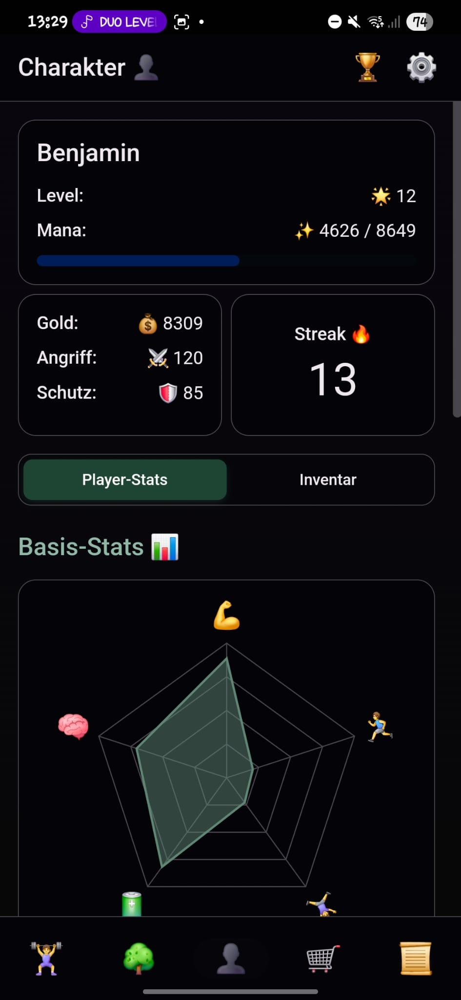
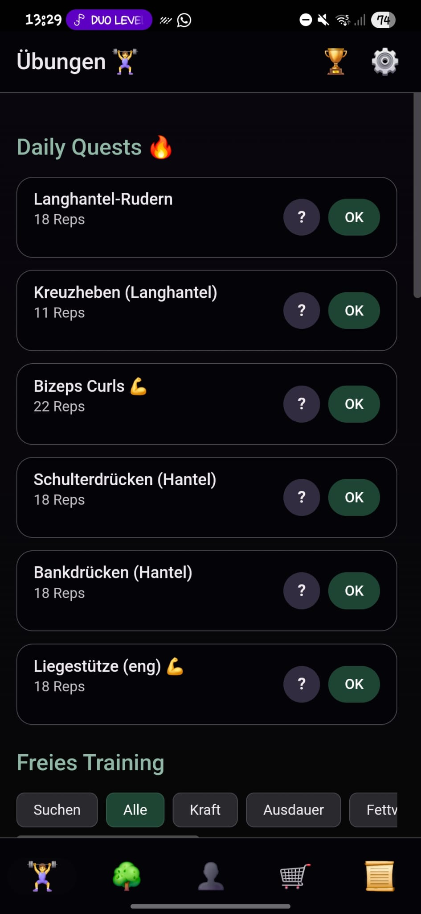
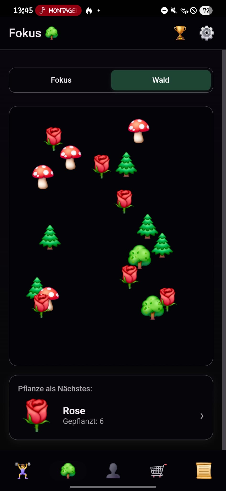

# DailyQuest Homepage

Dies ist die offizielle Homepage für die DailyQuest-Anwendung, eine gamifizierte To-Do-Liste und ein Gewohnheits-Tracker, der dein Leben in ein episches Rollenspiel verwandelt.

## Beschreibung

DailyQuest hilft dir, motiviert und organisiert zu bleiben, indem es deine täglichen Aufgaben in Quests verwandelt. Du kannst deinen Charakter aufleveln, Gold verdienen und neue Ausrüstung kaufen, um deine Werte zu verbessern. Die App ist für Leute gedacht, die ihr Leben produktiver und unterhaltsamer gestalten wollen.

## Funktionen

-   **Level-Up-System:** Schließe tägliche Quests ab, um Erfahrungspunkte (Mana) zu sammeln und deinen Charakter aufzuleveln.
-   **Dynamische Werte:** Verbessere die Attribute deines Charakters wie Stärke, Ausdauer und Fokus durch das Erledigen von realen Übungen.
-   **Fokus-Modul:** Trainiere deine Konzentration mit einem eingebauten Timer und lasse einen digitalen Wald wachsen.
-   **Shop:** Nutze dein verdientes Gold, um neue Waffen und Rüstungen zu kaufen und deine Werte zu verbessern.
-   **Erfolge:** Schalte Erfolge für das Erreichen deiner Ziele frei.
-   **Gewichts-Tracker:** Verfolge dein Gewicht mit einem einfachen Diagramm.

## Screenshots

| Charakter                                       | Tägliche Quests                                  | Fokus-Wald                                    |
| ----------------------------------------------- | --------------------------------------------- | ----------------------------------------------- |
|  |  |  |

## Tech-Stack

-   HTML5
-   CSS3
-   JavaScript

## Installation

Um die DailyQuest-App zu nutzen, musst du nichts installieren. Es ist eine webbasierte Anwendung, auf die du direkt in deinem Browser zugreifen kannst.

1.  Öffne die [DailyQuest Homepage](https://017pixel.github.io/DailyQuest-Homepage/).
2.  Klicke auf den "Zur App & Anleitung"-Button.
3.  Folge den Anweisungen auf dem Bildschirm, um die App für einen einfachen Zugriff zu deinem Startbildschirm hinzuzufügen.

## Benutzung

1.  **Richte deinen Charakter ein:** Definiere deine Ziele und lege den Schwierigkeitsgrad fest.
2.  **Schließe deine täglichen Quests ab:** Erledige deine Aufgaben und sammle Belohnungen.
3.  **Beobachte das Wachstum deines Charakters:** Verfolge deine verbesserten Werte und verwalte dein Inventar.
4.  **Werde stärker:** Investiere dein Gold in mächtige Ausrüstung, um noch besser zu werden.

